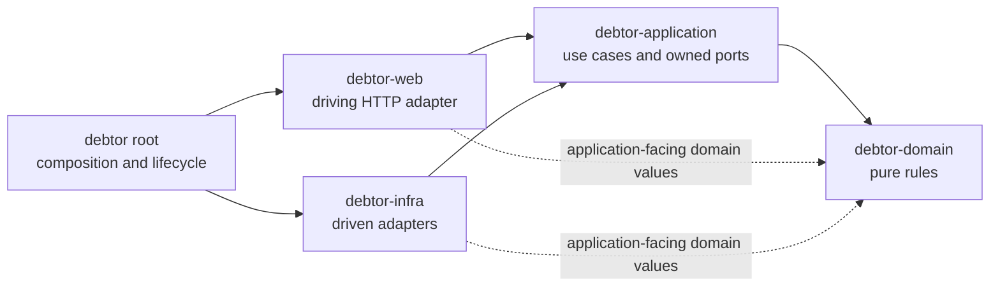
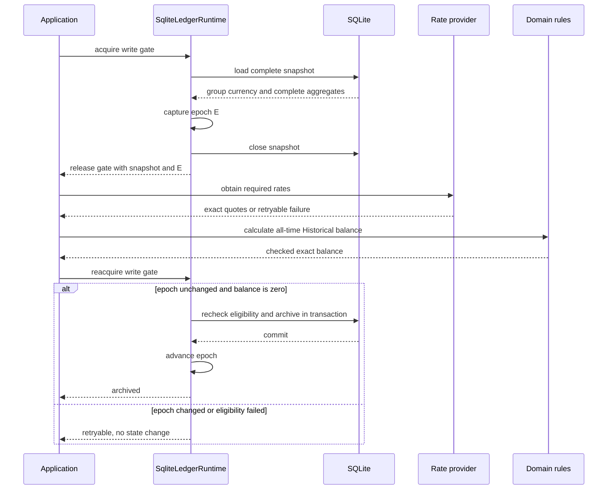
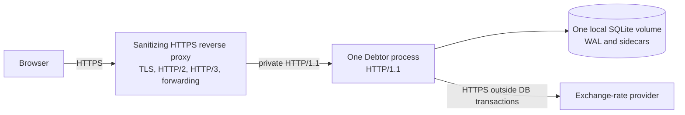
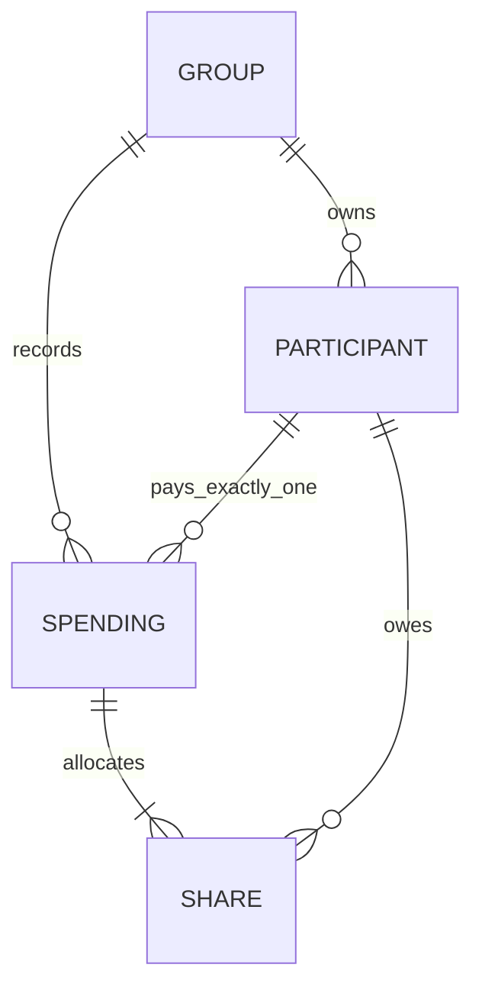

# Architecture Spine - Debtor

## Design Paradigm

Hexagonal Architecture with a domain-centric layered core:

- `debtor-domain`: pure synchronous deterministic domain rules.
- `debtor-application`: use cases and owned driving/driven ports.
- `debtor-web`: driving HTTP adapter.
- `debtor-infra`: driven persistence, provider, cryptography, cache, and runtime adapters.
- `debtor` root: configuration, concrete composition, migrations, lifecycle, and startup.

## Invariants And Rules

### AD-1 - Inward dependency direction [ADOPTED]

- **Binds:** all production crates and build dependencies
- **Prevents:** framework, adapter, persistence, or composition concerns flowing inward
- **Rule:** Dependencies follow `root -> web/infra -> application -> domain`. Web and infra may consume domain values only through application-facing contracts. Domain and application never depend on Axum, Askama, SQLx, reqwest, Argon2, sessions, or concrete adapters. Concrete wiring exists only in root.

### AD-2 - Layer responsibility ownership [ADOPTED]

- **Binds:** domain rules, use cases, adapters, handlers, and process lifecycle
- **Prevents:** duplicate policy and race-sensitive rules in the wrong layer
- **Rule:** Domain owns pure deterministic rules. Application owns command parsing, input and lifecycle policy, use cases, and ports. Infra owns authoritative transactional race guards and external adapters. Web owns HTTP decoding, authentication/session/CSRF mechanics, rendering, sanitized HTTP mapping, and harmless read composition. Root owns configuration, migrations, composition, startup, supervision, and shutdown.

### AD-3 - Exact monetary truth [ADOPTED]

- **Binds:** money, rates, allocations, balances, summaries, settlements, and persistence
- **Prevents:** precision loss and divergent Rust/SQL accounting
- **Rule:** All monetary and rate values use checked `rust_decimal::Decimal`. Persisted/hydrated values use domain `format_decimal`/`parse_decimal` and one canonical plain base-10 grammar: zero is `0`; signs are negative-only; exponent notation and redundant leading/trailing zeroes are forbidden; scale is normalized rather than fixed. Raw positive amount/weight input accepts unsigned plain base-10 text, including trailing fractional zeroes, then application parsing normalizes before domain construction; whitespace, signs, exponent notation, and excess precision are rejected. Money persists as canonical SQLite `TEXT`. Rust enforces positivity, exact payer/share equality, a maximum `999_999_999_999`, and minor-unit precision of 0 for JPY/KRW, 3 for OMR, and 2 for every other supported currency on input and hydration. Parsing, formatting, summation, allocation, quantization, and aggregation occur deterministically in Rust. Floating point, lossy conversion, SQL monetary arithmetic, and SQL monetary aggregates are forbidden.

### AD-4 - Group-owned identity and history [ADOPTED]

- **Binds:** groups, participants, spendings, allocations, and historical views
- **Prevents:** cross-group identity reuse and destruction of referenced accounting history
- **Rule:** Each participant belongs to exactly one group and is never reused across groups. New allocations require active participants owned by the spending group. An update may retain an archived participant only in the same existing payer or share role; it may not introduce or change that role. Referenced identities remain resolvable and are archived rather than deleted. A group with spendings is archived rather than deleted; destructive cascades are restricted to an empty group and its unreferenced participants. Archived groups expose read-only views and restoration only; every other mutation/form route rejects them before use-case invocation.

### AD-5 - Application policy with transactional enforcement [ADOPTED]

- **Binds:** spending commands, participant lifecycle, repositories, and all inbound adapters
- **Prevents:** transport-specific financial behavior and check-then-write races
- **Rule:** Application commands parse raw amounts, codes, dates, weights, and payer/share selections, construct allocations, inspect lifecycle state, and apply financial policy. Domain `Spending` is the complete shared aggregate: identity, group, description, positive bounded total, source currency, category, date, exactly one payer allocation equal to total, and one or more participant-unique positive shares summing exactly to total. Payer and shareholder are independent roles, so one participant may hold both. Proportional and Exact are the only share inputs; modes and weights are transient, stored edits reopen as Exact, and duplicate participant IDs are rejected. Proportional weights are positive, at most `1,000,000`, and at most six fractional digits. One shared Preview/commit operation normalizes a submission to integer ratios at its maximum scale, then uses checked `i128` numerator `total_minor_units * weight`, quotient/remainder by checked total weight, descending remainder, and ascending participant-ID residual assignment. Initial Exact shares divide total minor units by active-participant count and assign residual units in ascending participant-ID order. Invalid/unrepresentable construction is `Validation` and produces no aggregate. Multiple-payer and Equal-mode APIs are forbidden. Web only decodes transport structure and preserves submitted text. Every persisted precondition authorizing a lifecycle or spending write is authoritatively reloaded under the gate and checked in the committing transaction. SQLite structurally enforces the non-monetary references, codes, flags, bounded text, color shape, and date shape fixed by `specs/design.md`; Rust owns monetary and Unicode-trimming rules.

### AD-6 - Single ledger runtime and mutation epoch [ADOPTED]

- **Binds:** SQLite pool, all ledger writes, and process-local concurrency
- **Prevents:** unordered process-local writes and stale archival decisions
- **Rule:** One `SqliteLedgerRuntime` per process owns the SQLite pool, one five-second write gate, and one process-local mutation epoch. Every ledger write acquires the gate before beginning a transaction and advances the epoch only after successful commit. Timed-out gate acquisition starts no transaction or guarded side effect. SQLite uses local WAL, `synchronous=FULL`, foreign keys, and a five-second busy timeout. Among admitted valid operations, the last committed write wins; database revision columns and ordinary stale-edit conflicts are forbidden.

### AD-7 - Snapshot-complete calculation reads [ADOPTED]

- **Binds:** debt calculation, archival eligibility, converted summaries, and aggregate repositories
- **Prevents:** mixed-version aggregates and database transactions spanning provider I/O
- **Rule:** Calculation reads materialize group currency and every required complete spending aggregate from one SQLite snapshot. The transaction is released before rate-provider I/O or application/domain calculation. No provider request may hold a database transaction. Ordinary spending history uses fixed 25-item keyset pages ordered by `(spent_date DESC, id DESC)`; detail/edit/delete load one complete aggregate directly. Full-history snapshots are reserved for calculations that require them.

### AD-8 - Epoch-guarded participant archival [ADOPTED]

- **Binds:** participant archival
- **Prevents:** archival based on balances invalidated by concurrent ledger mutation
- **Rule:** Archival captures one immutable application-owned context containing the UTC calculation instant/date, complete all-time Historical-mode ledger snapshot, mutation epoch, requested/effective quote contexts, and returned quote bundle. It acquires the gate for snapshot+epoch capture, closes the transaction, then releases the gate before provider I/O and application/domain calculation. Final admission reacquires the gate and commits only when the epoch is unchanged, the UTC date and every quote-eligibility predicate still match the captured context, and the participant's exact Group Currency balance is zero. Any mismatch or unavailable eligible rate is retryable with no state change. Quote evidence is not persisted; a later attempt may observe provider revisions.

### AD-9 - Deterministic rate and settlement processing [ADOPTED]

- **Binds:** rates, converted summaries, debts, and settlements
- **Prevents:** provider completion order, cache state, or map iteration changing financial output
- **Rule:** One immutable application `CalculationContext` captures mode, UTC calculation instant/date, target currency, and ordered request contexts. A quote rate means target-currency units per one source-currency unit. For original requested date `R` and calculation date `C`, fetch date `F = min(R, C)`; deduplication, single-flight, and cache lookup key on `(source, target, R, F)`. Returned quote evidence adds provider effective date and exact rate. Historical is default and sets `R` to each spending date; Current sets `R = C` for every spending and is not persisted; `R > C` is provisional. Fixed-past keys (`R < C`) use the stable cache class and exact-key stale matching with no age limit. Current stale matching selects the latest prior current-class quote for the pair; future stale matching also requires the same original `R`. Both may cross rollover only after refresh failure and are eligible inclusively while `C <= prior_F + 7 days`. Same-currency conversion synthesizes exact rate `1` with `F` as effective date, performs no provider call, and remains in ordered disclosures. Provider JSON numbers decode lexically with arbitrary precision into `Decimal`. Each calculation deduplicates contexts and fetches at most four concurrently; one shared Frankfurter v2 adapter permits four calls globally, uses per-key single-flight, five-second connect/20-second total timeouts, and a 64 KiB response limit. Stable and refreshable caches each hold 4,096 contexts with deterministic LRU eviction; eviction may refetch, and later calculations may observe provider revisions, but one calculation's immutable quote bundle cannot change. Completion order cannot alter balances, disclosures, or warnings. Source nets are multiplied by the quote without intermediate rounding, accumulated exactly per participant, then truncated toward zero at target precision; positive residual units follow descending signed remainder, negative units ascending signed remainder, with ascending participant-ID ties, preserving exact zero sum. Negative balance means owes and positive means is owed. Settlement sorts separate debtor and creditor queues by descending amount then ascending ID, transfers the smaller head amount from debtor to creditor, advances only zeroed heads without resorting, and preserves generated order; results are positive, complete, pair-unique, and at most `n - 1`. Checked failure never panics, saturates, substitutes zero, or skips entries. Debts/transfers fail atomically under `Calculation`. Monthly summaries include the current UTC month, aggregate group and per-payer source totals by original currency, and convert each spending at its Historical quote without intermediate rounding. Exact per-payer converted totals are quantized together to target minor units by truncation toward zero, descending remainder, and ascending participant-ID ties; the group total is their exact sum. Missing quotes remain `Unavailable::ExchangeRates`; checked arithmetic remains `Calculation`. The summary projection consumes either cause, retains all source totals, and collapses only the rendered converted section to one unavailable warning; partial converted totals are forbidden. Spendings retain source currency; group currency is a changeable display target. Advisory transfers, mode, repayment, paid, and checkpoint state are never persisted. Debt disclosure includes mode, calculation time, target, ordered unique quote evidence, and stale/provisional warnings.

### AD-10 - Shared unsafe-request admission boundary [ADOPTED]

- **Binds:** login and every unsafe authenticated route
- **Prevents:** mutation dispatch without uniform authentication, CSRF, or duplicate-submission protection
- **Rule:** One shared unsafe-form pipeline performs outer body/concurrency/deadline admission, strict structural extraction with missing/unknown/duplicate detection, session load, CSRF validation, authentication/password admission, route parsing and web-only asynchronous prechecks, then atomic submission-token reservation and exactly one application mutation-use-case dispatch. Missing, malformed, duplicate, incorrect, expired, reserved, or consumed security values invoke no use case; CSRF failure precedes password verification and route-specific work. The web-owned token store separates 4,096 anonymous tokens (one/session, ten-minute inactivity expiry) from 1,024 authenticated tokens (32/session, 30-minute absolute expiry), uses indexed cleanup, and fails closed with retryable feedback at capacity. Reservation is terminal after one dispatch regardless of commit, rollback, task failure, or response delivery; pre-dispatch validation does not consume it. Composite business prechecks, including archival snapshots/rates, occur inside the dispatched application use case. After dispatch, request cancellation and generic timeouts cannot own mutation execution or prevent a definitive commit/rollback result.

### AD-11 - Native HTML authority [ADOPTED]

- **Binds:** web routes, forms, templates, static assets, and browser behavior
- **Prevents:** client-only behavior and security drift between enhanced and native paths
- **Rule:** Semantic server-rendered Askama HTML and native links/forms are authoritative. Self-hosted HTMX `2.0.10` and official `response-targets` `2.0.4` are the only client-side enhancement; expected enhanced `4xx`/`5xx` fragments target a stable announced status region. Exact official asset bytes and digests must be recorded and CI-verified before use; fixed asset routes serve the immutable mapped bytes with a fixed JavaScript media type and `X-Content-Type-Options: nosniff`. Custom JavaScript, custom HTMX extensions, inline scripts, and inline script attributes are forbidden. Core behavior remains functional without HTMX. Login and authenticated HTML send `Cache-Control: no-store`, `X-Content-Type-Options: nosniff`, `Referrer-Policy: no-referrer`, and `Content-Security-Policy: default-src 'none'; script-src 'self'; script-src-attr 'none'; connect-src 'self'; style-src 'self' 'unsafe-inline'; form-action 'self'; base-uri 'none'; frame-ancestors 'none'`. Every web story meets the applicable AD-18 UX contracts in addition to the browser, security, semantic-HTML, native-fallback, and accessibility requirements in `specs/design.md`; generic claims of accessible or responsive behavior do not replace cited geometry, focus, announcement, state, zoom, and parity criteria.

### AD-12 - Single-process edge topology [ADOPTED]

- **Binds:** production deployment, networking, sessions, and SQLite
- **Prevents:** unsupported distributed coordination and unsafe forwarding assumptions
- **Rule:** Production is one Debtor process with one local WAL SQLite volume behind one sanitizing HTTPS reverse proxy. Debtor serves private HTTP/1.1 TCP. The edge owns TLS, certificates, HTTP/2, HTTP/3/QUIC, `Alt-Svc`, fallback, forwarding sanitation, backend connection reuse, and body limits of at most 8 KiB for `/login` and 256 KiB for other forms. Early data is disabled or restricted to explicitly marked `GET`/`HEAD`; every unsafe early-data request returns `425` before backend forwarding. Edge timeouts may not expire an admitted mutation before its definitive result. One root-composed trusted-client resolver accepts forwarding input only from a socket peer in `APP_TRUSTED_PROXY_CIDRS`, parses exactly the selected `APP_TRUSTED_PROXY_HEADER` mode, walks the trusted chain right-to-left, rejects malformed/ambiguous input, and otherwise uses the direct peer; all client-IP consumers use it. Multiple Debtor instances, external SQLite writers, shared or persistent sessions, and direct production HTTP are unsupported.

### AD-13 - Process-local owner uniqueness [ADOPTED]

- **Binds:** root composition and shared runtime state
- **Prevents:** split admission accounting, duplicate caches, and bypassed serialization
- **Rule:** Root composes exactly one instance of every process-local shared-state owner: `SqliteLedgerRuntime`, session store, submission-token store, trusted-client resolver, login limiter, rate cache and single-flight coordination, global provider-call limiter, request/probe admission budgets, and dispatched-mutation registry. Session-expiry cleanup and submission-token cleanup are mandatory supervised workers; either worker's failure fails readiness, stops new admission, and initiates shutdown. Use cases receive application-owned ports; concrete owner and adapter types remain outside application and domain.

### AD-14 - Bounded operational envelope [ADOPTED]

- **Binds:** HTTP admission, providers, sessions, caches, startup, and shutdown
- **Prevents:** unbounded resource use and ambiguous cancellation
- **Rule:** Login bodies are limited to 8 KiB and other forms to 256 KiB. User, login, and separately admitted probe concurrency are capped at 64, 4, and 4. Safe dynamic reads and login have 30-second timeouts, debts 90 seconds, and probes a two-second outer/one-second SQLite inner timeout. Mutations have one 30-second absolute pre-dispatch deadline through web prechecks and token reservation; after dispatch no application or edge timeout may cancel execution. Anonymous sessions expire after ten inactive minutes and are capped at 4,096 without evicting authenticated sessions; authenticated sessions use 30-day sliding inactivity refreshed on every request and are capped at 32 without eviction. Anonymous sessions are explicitly saved before login HTML. Correct-password promotion atomically rotates and durably stores session ID, authenticated state, and CSRF before `Set-Cookie`/redirect; failed persistence returns retryable feedback without an authenticated cookie. At capacity promotion flushes the anonymous session and returns retryable `503`; logout flushes and restart invalidates sessions. Cookies are `HttpOnly` and `SameSite=Strict`; non-debug builds require `Secure`. After valid CSRF, the limiter reserves one attempt immediately before every password verification, including a correct one; pre-verification rejection records none, and history resets only after durable authenticated promotion. It permits five attempts per trusted client IP per rolling five minutes, tracks 4,096 active keys with indexed expiry, never evicts active keys, and fails closed with retryable `429` for an unseen key at capacity. `APP_ADMIN_PASSWORD_HASH` is at most 256 bytes and canonical Argon2id v19 PHC with memory `19,456..=65,536 KiB`, iterations `2..=5`, parallelism `1..=4`, salt `16..=64` bytes, output `32..=64` bytes, and exactly `m/t/p`; length and structure reject before decoding/KDF, at most two verifications block, and the helper emits `19,456/2/1`, 16-byte salt, 32-byte output. Production requires nonempty trusted proxy CIDRs and one recognized header mode; invalid policy fails startup, while empty direct-peer mode is debug/local only. Startup admits no socket traffic until configuration, proxy/password policy, migrations/pragmas, singleton composition, and mandatory supervisors succeed. The mutation executor publishes `Committed` or `RolledBack` synchronously and infallibly immediately after the authoritative persistence result and before response work. Shutdown stops admission and drains HTTP for at most ten seconds, then waits without a fixed total deadline until no registry entry remains running before WAL checkpoint and pool close. Task failure may publish `RolledBack` only when rollback is established; otherwise `Unknown` is fatal, suppresses automatic retry, and is never represented as rollback. Sidecars are preserved if checkpointing fails.

### AD-15 - Safe failures, logging, and readiness [ADOPTED]

- **Binds:** ports, adapters, HTTP responses, diagnostics, and probes
- **Prevents:** adapter detail leakage and external dependencies incorrectly gating service health
- **Rule:** Application owns the exhaustive safe taxonomy and web mapping: `Validation` is rejected user input (`422`); `NotFound` is absent identity (`404`); `Conflict` is a valid request blocked by lifecycle, epoch, or submission-token state (`409`, retryability reason-specific); `Unavailable` is provider/auth/runtime/capacity failure (`503`, except login limiting is `429`); `Storage::Contention` is retryable `503`, while invalid persisted data and unexpected storage are `500`; `Configuration` is startup-fatal; `Calculation` is sanitized checked financial failure (`500`, except monthly conversion maps to converted-section unavailability). Raw adapter diagnostics never cross inward-facing ports. One cross-sink diagnostic policy applies to logs, spans, metrics, panic/crash hooks, probes, and exporter self-diagnostics: only fixed operation names, bounded reasons, and approved low-cardinality fields may leave an adapter. Credentials, hashes, cookies, session/CSRF/submission tokens, limiter keys, client IPs, query strings, provider URLs, SQL/database messages, monetary values, identifiers, raw errors, and request-derived data are forbidden. `/healthz` reports process liveness; `/readyz` checks SQLite and the session/token cleanup supervisors only. Provider availability and ledger contents never gate readiness, and probe/static routes never create or load sessions.

### AD-16 - Injected effects and layer-owned verification [ADOPTED]

- **Binds:** clocks, repositories, providers, cryptography, tests, and architecture fitness
- **Prevents:** untestable use cases and boundary regressions hidden by integration-only coverage
- **Rule:** External effects enter through narrow constructor-injected application-owned ports. Application use cases run with fakes and injected clocks without Axum, SQLite, network, or wall clock. Pure financial invariants are tested in domain; use-case policy in application; SQL, HTTP, provider, session, and cryptography behavior in their adapters; root retains composed startup and real-socket smoke coverage. Architecture fitness reads `cargo metadata`, requires every production package, and validates normal/build dependency direction; responsibility ownership uses targeted compile/integration tests rather than source-token scans. Dependency governance trims features before isolated Askama, reqwest, tower-sessions, and SQLx upgrades, groups weekly patch/minor updates, isolates majors, and enforces advisories, sources, and reviewed permissive licenses with `cargo-deny`.

### AD-17 - Permanent single-administrator boundary [ADOPTED]

- **Binds:** authentication, authorization, participants, persistence, and routing
- **Prevents:** independently built features introducing incompatible user or tenant identities
- **Rule:** Debtor has exactly one administrator authenticated by a password gate. There is no username, registration, user table, tenant model, participant authentication, or multi-user authorization. Participants are accounting identities only.

### AD-18 - Governed UX contracts and traceability [ADOPTED]

- **Binds:** every web route, Askama template, rendering projection, CSS rule, native interaction, HTMX enhancement, and web acceptance test
- **Prevents:** final UX contracts remaining advisory, story implementations omitting interaction requirements, and native/enhanced paths diverging
- **Rule:** `specs/design.md` and accepted ADRs remain authoritative for product, security, accounting, and architecture invariants. Within that envelope, final `DESIGN.md` owns visual identity, tokens, component geometry, and responsive composition; final `EXPERIENCE.md` owns information architecture, interaction behavior, states, focus, announcements, and native/enhanced parity. Neither UX contract may silently override an upstream invariant; conflicts stop implementation until synchronized. Mockups, wireframes, imports, and `.working` artifacts are illustrative only. Every affected web story and acceptance test cites applicable stable `UX-*` IDs. A story is incomplete if it implements only one required path, viewport, state, or verification dimension.

## Consistency Conventions

| Concern | Convention |
| --- | --- |
| Feature naming | Plural capability names: `groups`, `participants`, `spendings`, `debts`. |
| Interfaces | `*Reader`, `*Repository`, `*Provider`, `*UseCases`; implementations `*Service`, `*Store`, `*Client`, `*Gate`. |
| Boundary data | Transport-neutral raw commands use `*Input`; persistence rows use private `Db*`; rendering projections use `*Template`, `*Row`, or `*View`. |
| Identifiers | Ledger entity IDs are positive `i64`; UUIDs are limited to session and token randomness. |
| Dates and ordering | Strict `YYYY-MM-DD`, UTC defaults/calculation dates, explicit deterministic sorting, participant ID tie-breakers. |
| Errors | `thiserror` for typed domain, application, and adapter errors; `anyhow` only at the root process boundary. |
| Persistence | Checked SQLx queries, committed offline metadata, Rust-owned canonical decimal validation, no SQL monetary aggregation. |
| HTTP mutations | Strict shared extraction, `422` with retained input for validation, `303` after success, `409` for lifecycle/epoch/submission-token conflicts, and `429` for login limiting. |
| Source precedence | `specs/design.md` is normative and accepted ADRs record its decisions. This spine constrains epic architecture; final `DESIGN.md` and `EXPERIENCE.md` govern visual and interaction details within that envelope. Superseded scaffold code, mockups, and working artifacts have no authority over them. |
| Change authority | Update `specs/design.md` before behavior changes; synchronize ADRs, configuration examples, migrations, tests, and SQLx metadata. |
| Compatibility | Before first deployment, remove superseded APIs, routes, configuration, and schema paths rather than add compatibility shims. |

## Stack

| Name | Version |
| --- | --- |
| Rust | 1.97.1, edition 2024 |
| Axum | 0.8.9 |
| Askama | 0.16.0 |
| Tokio | 1.53.1 |
| SQLx / sqlx-cli | 0.9.0, bundled SQLite |
| reqwest | 0.13.4, rustls |
| rust_decimal | 1.42.1 |
| HTMX | 2.0.10 |
| HTMX response-targets | 2.0.4 |

Versions were verified on 2026-08-10 against the pinned Rust distribution, `Cargo.lock`, current crates.io/SQLx documentation, and official npm metadata. `Cargo.lock` is the exact Rust dependency authority.

## Structural Seed

`Spending` is the application/domain aggregate boundary; table decomposition remains persistence-owned.

| Environment | Binding envelope |
| --- | --- |
| Local debug | One process/local SQLite; direct HTTP and insecure cookie allowed only in debug; provider outage cannot block startup or CRUD. |
| Test/CI | Same domain/application contracts with fakes or temporary SQLite; locked toolchain, architecture fitness, offline SQLx, tests, Clippy, and dependency policy gate promotion. |
| Staging/production | Production cookie, proxy-trust, edge, persistence, migration, resource, and shutdown contracts; production secrets enter only through validated configuration. |

First release uses Frankfurter v2 behind the application-owned `ExchangeRateProvider`; its validated base URL is configuration, and provider availability never gates startup/readiness.

## Brownfield Disposition

| Disposition | Existing reality |
| --- | --- |
| Retain | Four-crate dependency direction, root composition/runtime, SQLx checked-query workflow, SQLite pool/write gate, exact-money domain functions, Frankfurter adapter boundary, session/limiter supervisors, architecture fitness. |
| Replace or remove | Reusable memberships/global participants, plural payer collections, Equal share mode, global participant routes, inline spending flow, and every API/schema/test encoding those superseded concepts. |
| Migration authority | `specs/design.md` and AD-3 through AD-9 define the target; clean breaking migrations replace superseded paths without shims. |

## Capability To Architecture Map

| Capability / Area | Lives in | Governed by |
| --- | --- | --- |
| Groups and participant history | Domain rules, application lifecycle use cases, infra repository, web views | AD-2, AD-4, AD-5 |
| Spending creation and editing | Application commands, domain allocation rules, infra transactional aggregate store | AD-3, AD-5, AD-6 |
| Participant archival | Application orchestration, domain balance rule, infra ledger runtime and rate adapter | AD-6, AD-7, AD-8 |
| Monthly summaries | Application read use case, domain Rust aggregation, infra snapshot/rate adapters, web rendering | AD-3, AD-7, AD-9 |
| Debts and advisory settlements | Domain calculation, application orchestration, infra snapshot/rate adapters | AD-3, AD-7, AD-9 |
| Authentication and unsafe forms | Application admission orchestration, infra password adapter, web session/CSRF/token boundary | AD-10, AD-13, AD-14 |
| Administrator identity boundary | Password-gate use case, web session boundary, root configuration | AD-10, AD-17 |
| Native and enhanced HTML | Web routes, Askama templates, rendering projections, CSS, static assets, and web acceptance tests | AD-11, AD-18 |
| Persistence and concurrency | Infra `SqliteLedgerRuntime`; root singleton composition | AD-6, AD-13 |
| Deployment and edge security | Root runtime and external sanitizing proxy | AD-12, AD-14 |
| Failures, logs, probes, lifecycle | All adapters; root supervision and lifecycle | AD-14, AD-15, AD-16 |

## Deferred

| Item | Decision boundary |
| --- | --- |
| Physical table/index names and migration statement order | Persistence epic; logical ownership, cardinalities, constraints, aggregate boundaries, and transaction rules are already fixed. |
| Route inventory, template layout, and source-tree layout | Implementing epics; native behavior and crate ownership are already fixed. |
| Migration sequencing from obsolete scaffold | Migration epic; normative target behavior takes precedence. |
| Reverse-proxy vendor and vendor-specific configuration | Deployment implementation; edge responsibilities are already fixed. |
| Deployment automation, artifact packaging, durable-volume ownership, backup/restore, upgrade/rollback | Operations design before first production deployment; topology and lifecycle interfaces are already fixed. |
| Telemetry backend, retention, export protocol, and alert routing | Operations design before staging acceptance; diagnostic schema and required health signals are already fixed. |
| Cache internal representation | Rate-adapter implementation; keys, classes, bounds, rollover, stale eligibility, determinism, and single-flight semantics are binding. |
| Exact HTMX asset digests | Vendoring implementation before any enhanced route ships; official version, provenance, byte verification, and self-hosting are binding. |
| Future horizontal scaling, shared coordination, external writers, persistent sessions, and database replacement | Post-first-release architecture; all are unsupported in this scope. |
